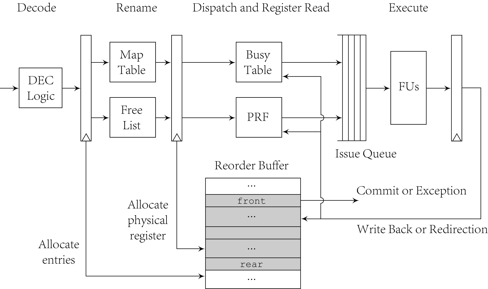

# Writeback and Commit Stage

This directory includes code related to writeback and commit
stage. It receives execution bundle from function units and
write them back to physical register file and reorder buffer.
The continuous instructions in the front of ROB will be
committed if no exception happens. Exception is detected at
committing while Wrong speculation is detected at writeback.

Entities of writeback and commit stage include reorder buffer,
physical register file and busy table, which are implemented in
`commit.sv` for ROB and `prf.sv` for PRF/BT. The following
figure shows the position of these entities.

## Commit Module

Commit module contains ROB and handles exception and wrong
speculation with support of in-order structure. An ROB entry
includes some status bits, including `ren`, `exe`, `spc` and
`saf`. `ren` and `exe` record the status of each instruction,
meaning related entry is already renamed or executed, so that
they will be modified after rename stage and at writeback.
`spc` records for load instructions whether speculated to
prevent committing. This field is modified by writeback of LSU.
`saf` means that no redirection will happen because of related
instruction. This is to determine whether store instructions
can be sent to memory system. This field is modified after
decoding and execution.

Except the above fields that represents instruction status and
requires initialization on reset, some other ROB fields contain
information like mapped register numbers for renaming recovery.
These fields can be implemented by multi-write-port RAM. The
fields are defined in `rob_dec_t`, `rob_ren_t` and `rob_exe_t`
and instantiated in `commit.sv`.

For some wide values that only the earliest are useful, ROB
provides basic optimization to only record the earliest value.
For example, when exception happens and is written back to ROB,
a 64-bit trap value should be recorded to finally be used when
related instruction is in the front of ROB. This instruction
will be compared with recorded exception, and if it is earlier
than the recorded, it will take place.

Commit logic assembles `com_bundle` to mark the retirement of
instructions, if no exception happens, no rollback is
happening, no speculation stucks committing and several
instructions in the front of ROB is already executed, commit
module will sent `com_bundle` to decoder, renaming module and
LSU to deallocate resources related to retiring instrctions.

If exception or wrong speculation happen, commit module outputs
`red_bundle` to other stages in pipeline. `red_bundle` can be
from writeback stage or commit stage. For exceptions or wrong
load speculation that needs rollback before redirection,
`red_bundle` is assigned when it would be committed. While for
branch and jump instructions, there records snapshots in
renaming module, and they also use `red_bundle` to recover
every modules. Redirection at writeback stage for stages after
issuing is more complicated than those before issuing, because
not all instruction stored in these stages are after the
redirection instruction. So for issue queue and buffers in
function units, the operation ID should be recorded for each
instruction and compared with the redirection ID to invalidate.
`red_bundle` should also includes information to update
frontend, so that now it includes patterns, global history and
some folded global history in TAGE implementation.

Specially, instruction `fence.i` and `sfence.vma` are also
recorded in execution field of ROB. When they reach the front,
pipeline will be flushed by putting next PC in `red_bundle` and
send signals to memory system to flush icache or TLB.

## PRF Module

Physical register file module includes physical register file
and busy table. The behaviors of PRF and busy table are similar
as they both get source physical register numbers from renaming
module after mapping, provide physical register busyness
and values to issue queue and finally are udpated by writeback
module. The written-back values can be forwarded to read ports.

## CSR Module

CSR module maintains values of control-and-status registers and
handles read and write requests from pipeline. It also supports
Zicntr and Zihpm extension to support reading HPM counters in
user mode. There are some CSRs requiring pipeling flush after
reading or writing such as `mstatus`, because it controls
behavior of previous stages and may influence the instructions
that are already being executed.
