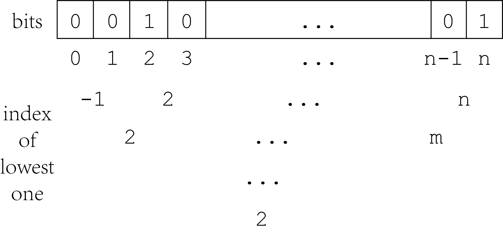
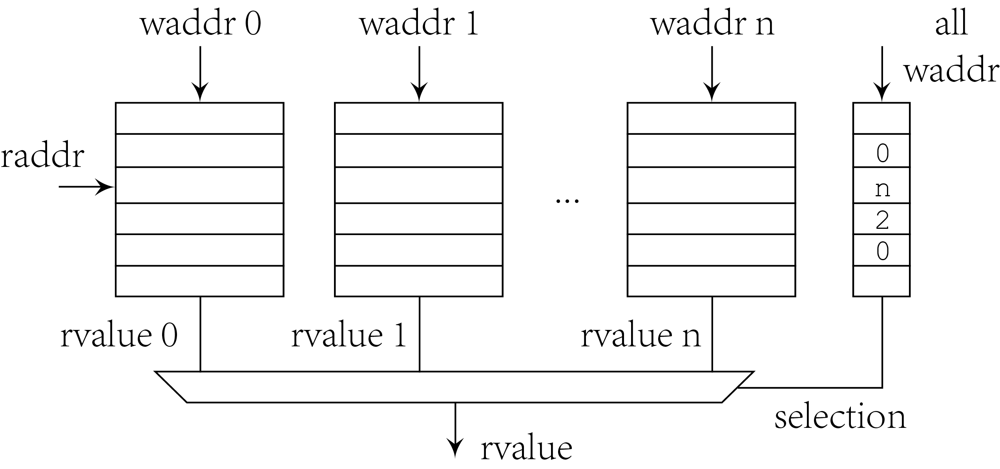

# Common Code

This directory includes common code used by other modules. Some
are implemented by SystemVerilog modules, while some are simply
functions and type definitions.

## Types Definition

For the convenience of data passing in pipeline, output of each
stage is grouped into bundles which defined in `types.sv`. The
stages convert one type of bundle to another type, and put them
into RAM or registers. Specially, `red_bundle` is grouped in
commit module according to the redirection information in
`exe_bundle` and `com_bundle`. In `types.sv`, fields in ROB is
also grouped by the stages that writes into ROB. `rob_dec_t`
includes basic information like identifier and logical register
numbers. `rob_ren_t` only includes destination physical
registers, old and newly mapped. `rob_exe_t` includes some
execution results. Functional codes are grouped to control the
function units.

## First k-th Elements Searcher

The module in `firstk.sv` searches for the first k-th ones in
an array. It is based on divider-and-conquer algorithm as the
following figure depicts.

The figure illustrates searching for the lowest one, each level
has some wires to record the lowest index in related range. If
lowest one does not exist, it will be specially marked, which
shows -1 in the figure and allocates a new bit in the HDL code.
For k-th one, the algorithm is similar. The values in depth `d`
can be calculated by recurrence formula when values of first
one to k-th one in depth `d-1` are calculated.

## Multi-write-ports RAM

Synthesis tool for Genesys-2 will implement RAM with multiple
write ports using registers instead of distribute RAM or block
RAM. However, there are many multi-write-ports RAM structures
such as issue queue and ROB in current design. There may be
some optimization like using banks, but currently we provide
an alternative solution to use distributed RAM for these
structures, in order to reduce LUT utilization.

The basic idea is to use duplicate RAM controlled by fewer bits
of selection, so that LUT and FF resources are reduced from
`width` to selection width. Different write ports will write to
different banks, and for each row there are selection bits
indicating which bank contains the newest written value. So the
read ports read from all banks and use the selection bits to
finally determine the read values. The selection bits can not
be implemented by distributed RAM because of it has multiple
write ports so that for structures with narrow width such as
bimodal history pattern, this method does not have less LUTs.

## Physical Memory Attributes

PMA defines layout of physical memory and the attributes of
them. Currently there are only cacheability and idempotency.
Cacheability is used in MMU to decide whether to access data
from cache, while idempotency is used in LSU to avoid
speculation on some MMIO registers.

## Physical Memory Protection

PMP is used to check validity of a memory operation according
to PMP CSRs. It follows check routine in RISC-V specification
and combinationally convert input address to read/write/execute
permissions. PMP module is instantiated in fetch module and LSU
to generate an access fault if violation exists.
