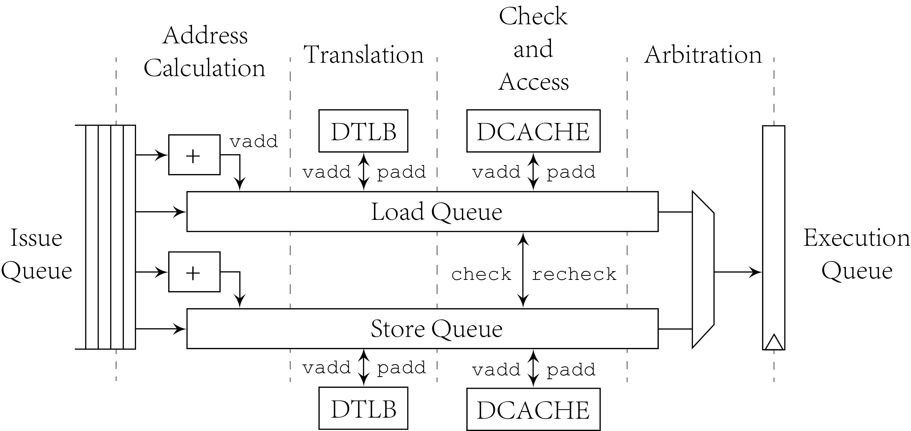
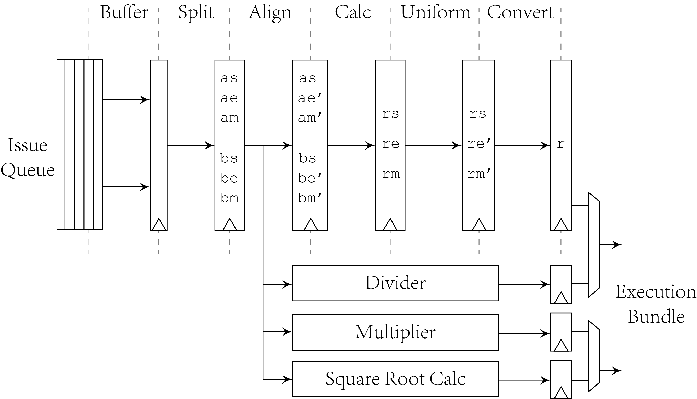

# Execution Stages and Function Units

Execution stages take functional code and oprands from issue
queue and output execution results to be written back to PRF
and ROB. All the issued instructions are broadcast to all
functional units, and functional units choose related
instructions to operate and finally calculate execution result.

## Execution Module

Since the register read stage is moved before issuing and
functional units take `iss_bundle` directly from issue module,
execution module only arbitrates results of all functional
units and assembles final `exe_bundle`. Execution bundles
mainly include values written to register file and exceptions
if there exist. There also includes information passed from
previous stages such as branch predictor patterns.

## Arithmetic and Logical Unit

ALU processes single-cycle instructions. The execution width
`ewd` indicates how many instructions can ALU module process in
a single cycle. Except normal arithmetic and logic instructions
like `add`, `or`, and `min`/`max` to handle some atomic
operations, some instructions related to exception or system
functions also use ALU to implement. The following types are
generated from previous stages and passed to ALU.

- Instruction access fault and page fault are generated by
    fetch unit.
- `mret` and `sret` are generated by decoder.
- Interrupts are generated by decoder.
- Fence instructions are generated by decoder.
- `wfi` is generated by decoder.
- `ecall`, `ebreak` and invalid instructions are generated by
    decoder.

To avoid interrupt affects instructions like store and CSR
write that are not recoverable, interrupts affect pipeline
through decoder. If an interrupt is enabled and pending,
decoder will then only output HINT instructions indicating this
interrupt and finally executed after previous instructions
executed. This means if an instruction that are already in
pipeline and executed issues an exception, the pipeline will
firstly handle this exception and disable interrupt enable. The
interrupt will be revealed after the exception is handled.

Because of there are some instructions in FIFO as RAM entry, if
redirection happens, the succeeding instructions may not be
easily removed. In this situation, the related entries will be
marked as bubble and if they reach front of output FIFO, these
instructions will be invalidated then.

## Load/store Unit

Basic components of LSU are load queue, store queue, and output
execution queue. Load/store and CSR read/write instructions are
seleted from `iss_bundle` and put into related queue according
to the `ldid` and `stid` allocated in decoding stage. Then LSU
selects entries from load queue and store queue for address
translation. After physical addresses returned from MMU, LSU
writes them to load queue and store queue for relevance
checking and memory access. The following figure depicts stages
in LSU.

Within each cycle, LSU will select some entries and send them
to DTLB, DCACHE or relevance checker according to control bits.
To identify each memory request, TLB and cache transaction has
unique ID using index of load queue and store queue. When
responses of transaction returned from MMU, LSU will write back
values according to this ID. To support speculation, some
in-progress requests should also be cancelled if it is after a
redirected instruction. A flushing bitmap `fl_data` is
assembled in LSU and sent to MMU to invalidate buffered
requests like in MSHRs. Each bit in the bitmap controls related
unique ID to be flushed. LSU will also use this bitmap to
invalidate entries in load queue and store queue. There is also
a instruction flush bitmap in fetch unit similarly.

To support speculative load, which means get data from cache
and write back execution results to pipeline for a load
instruction even when consistency may be violated after
previous store or load addresses are calculated. This is to get
maximal performance of out-of-order execution of memory access
addresses, but retry should be supported in case of a wrong
speculation. Different from exception and other speculation
such as branch prediction, speculative load cannot obtain
speculation correctness after execution. So there should be a
mechanism to prevent ROB from committing speculative load. LSU
will set an speculative bit `specul` in execution bundle, store
them in ROB, and finally reset it by resend this bundle after
there is no violation of consistency. Details of relevance
check are described below:

- LSU selects unchecked entries in LSU and search for
    effective overlapped address in store queue.
- The check result has three types
    - unable to access before all previous operations done
    - able to access but may violate consistency
    - able to access and will not violate consistency
- When a store address is calculated, it rechecks all
    succeeding load entries that may violate consistency.

LR/SC support is also implemented in LSU. Bit 0 of `rsrv` in
functional code indicates these two types of instructions. In
RISC-V specification, instruction `lr` should register address
in reservation set, and following `sc` should check in the
reservation set and fail if there is no reservation. To
simplify implementation, the specification defines constrained
LR/SC loops. It contrains instruction between LR/SC loops
within "I" extension. This means that implementations can
restrict size of reservation set to any numbers. So in `lsu.sv`
only one register is used to store reserved address.

Store instructions should be sent to data cache when it is not
speculative. This can be done by being confirmed by ROB front
entry. However in situations like consecutive stores, this will
operate serially and suceeding instructions will wait for
committing cycle of the store instruction. To pipeline this,
safe bits are maintained in ROB and some instructions can be
determined as safe even after decoding. In LSU, if a request
is sent to data cache, it will be seen as safe, but if in next
cycle data cache returns a missed response, the safe assertion
should be canceled.

CSR read/write instructions make use of store queue because
they should also wait until ROB confirmation arrives. ALU and
other modules may not be such convenient to provide waiting
mechanism as LSU. An extra `sq_csr` field is added into store
queue indicating CSR read/write instruction type.

## Multiplier

The multiplier calls DSP modules on FPGA by multiplication
operator and shift registers. If FPGA synthesis does not
support multiplication operator implication, custom
implementation will be required. To handle different types of
multiplication operations, including signed operation or
calculation of higher 64-bits, `mul.sv` extends oprands to
128-bits to perform multiplication and shifting. Whether
performing signed or unsigned extension depends on functional
code.

Multiplier is pipelined since shift registers are used. However
it only take one operation at a time, so that input buffer is
required for superscalar implementation. If no space in the
buffer is left for pipeline number of operations, it will send
busy signal to issue module preventing succeeding issuing. This
buffer is called register read buffer for the historical reason
that register read was after issuing previously. It may be
modified sometime.

## Divider

Divider also puts multiple operations into input buffer like
multiplier. Then it tries out each bit of quotient using
repeated subtraction. In implementation in `div.sv`, `a` is
dividend, `b` is divisor and `r` is quotient. The register `c`
counts the position of trying bit and controls state of the
subtraction.

`c` is initially 64 indicating idle state, and then incoming
request decreases it cycle by cycle meaning current trying bit.
If it decreases to negative value `-1`, calculation is finished
and takes another cycle to handle functional code to handle
sign extension and mux from quotient or remainder.

## Floating-point Unit

Floating-point unit handles "F" and "D" extension and
implements a floating-point pipeline as the following figure.

Each FP operation at most has two oprands and firstly are
buffered similar to multiplier and divider. Then comes split
stage, decoding the oprands into sign bit, exponents and
mantissas. Many operations requires two oprands and their
alignment, which is operated in the third stage. With splited
and aligned oprands, the next stage calculates result according
to functional code and gets sign, exponent and mantissa of the
result. The result may be non-uniform, uniform stage make the
floating point result canonical. The last stage encodes three
part of floating-point result into IEEE-754 format, output the
converted result and assemble execution bundle.

Most FP instructions can make use of the stages above and use
functional code to mux and generate output of each stage. But
there are three types of operations that require extra logic.
They are multiplier, divider and square root calculator. The
multiplier and divider use similar algorithm as integer ones.
The square root uses extra multiplier to try each bit and
approximate the final result. Execution bundles that generated
by normal pipeline and division are multiplexed into first
execution bundle, while those generated by multiplier and
square root calculator are multiplexed into second one.

The output result also includes result `fflags`, field of
user-level CSR `fcsr`. To determine calculation flags including
overflow, underflow, invalid result and inexact result, in the
split stage, more than 52 bits are used to contain sticky bits
and upper bits. During calculation these extra bits are also
participate in calculation and finally indicate overflow, under
flow or inexact information. The details of special cases are
described in RISC-V specification.
