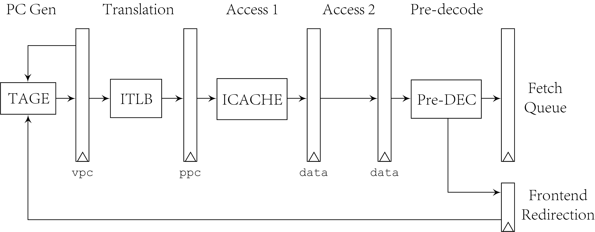

# Fetch Stages

The fetch unit in CROSP takes four pipeline stages to translate
virtual PC, get data stream from instruction cache, split the
instruction stream, and pre-decode. The branch predictor is
also included in this directory, generating next PC to update.

## Branch Predictor

The branch predictor is splited from fetch unit for its
complication. Different algorithm can be used. Currently the
branch predictor is implemented by basic TAGE algorithm, it is
based on the design in article
*A PPM-like, tag-based branch predictor*,
and described in the following figure.

It maintains a bimodal table and four tagged table. The method
maintaining tags are also from this article, which uses
circular shift registers. And Global history in the design is
saved in a circular queue, and passed to other module with
format of indices. If redirection are issued by execution
module, the global history will be recoverd by simply moving
rear pointer. In contrast, the CSR is recovered by passing
their values instead of pointers. The branch direction is
obtained from these five banks and uses the valid one with
longest history length according to TAGE algorithm. Branch
target comes from branch target buffer. The BTB also uses PC to
index. All the tables can be implemented by distributed RAM on
FPGA, using implication of single-write port array.

## Fetch Module

The core of fetch module is fetch target queue, which decouples
branch predictor with instruction fetch and buffers physical
addresses and data. FTQ has some fields including virtual PC
`vpc`, physical PC `ppc`, `data`, access fault `af`, page fault
`pf` and some fields passing branch predictor information. The
related pipeline is showed in following figure, FTQ fields are
abstracted as pipeline registers.

Every entry in fetch target queue corresponds with one
prediction from branch predictor, including fetch address `pc`
and fetch number `num`. The unit of fetch number is 16-bit to
support compressed instruction fetch. The branch predictor
should predict several continuous addresses from PC and find
first break to calculate number of 2-byte data until
instruction stream break. If no branch occurs in continuous
branch predictor, the number will be maximum fetch number. With
this method, data in FTQ make up continuous instruction stream
by concatenating all valid data indicated by `dat` and `num`.
The following picture shows structure of FTQ and how branch
predictor fills an entry.

Pre-decoder gets data from adjacent `dat` fields and assembles
several instructions. Lowest 2 bits of data stream determines
whether instructions are compressed. So there may be some data
left over after a fetch from `dat` fields. `cur` of each entry
indicates the cursor of `dat` field, instruction stream in
current cycle starts from this cursor.

There are three types of instructions that pre-decoder
recognizes, `branch`, `jal` and `jalr`. Specially,
`jal x1/x5, target` is recognized as `call target`
pseudo-instruction while `jalr zero, x1/x5` is recognized as
`ret` pseudo-instruction. The pre-decoded results are used to
check basic validation of branch predictor. Branch result and
target are compared with those calculated by pre-decoder, so
that a frontend redirection can be issued to branch predictor
as soon as possible. Except basic validation such as whether
actually jumps at a `jal`, to optimize performance of function
call, a return address stack is provided. `call` instructions
push address in this stack and `ret` instructions get and pop
addresses from it. `call` and `ret` instructions are
speculative. If a `call` instruction is later found not
supposed to happen because of previous wrong branch prediction,
related address in RAS will not be cleared and afterwards
addresses gotten by `ret` may be wrong.
