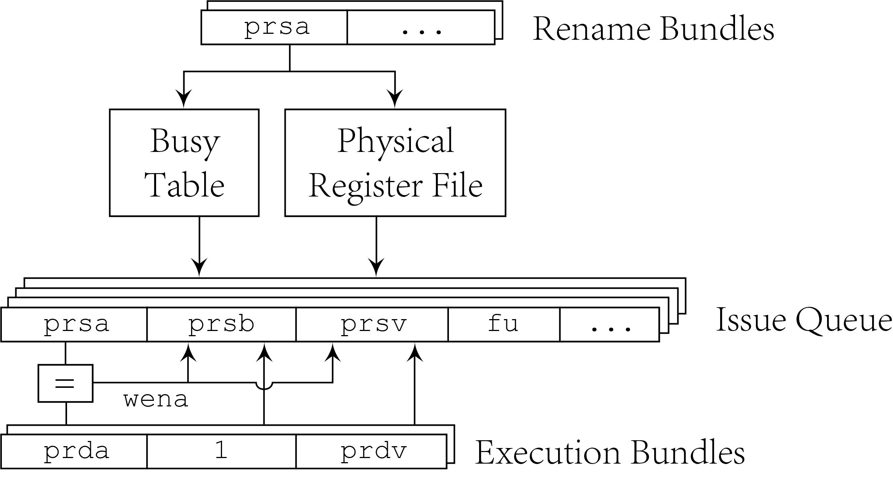

# Issue Stage

In current design, issue queue is a unified queue for all
instructions, waiting oprands and functional units to be ready.
Since register values are read before issue, for busy registers
issue queue should also wait for execution units to write back
execution results. This means that all entries in issue queue
should snoop on the common data bus. When writeback results are
passed by `exe_bundle`, each entry in issue queue compares
related register address `prsa` with `prda` in `exe_bundle`,
and if there is a match, `prsb` in the entry is set and `prsv`
is set to execution result `prdv` in execution bundle.

The issue logic decides which entries can be issued and chooses
some of them to be issued to functional units. Currently for
simpliciation, all the bundles in issue queue can be issued and
issue priority is decided by issue queue index. Although issue
queue is unified, LSU has an extra issue logic for performance
optimization, so that issue queue can issue more than `ewd`
operations to all functional units. Another reason to separate
LSU bundles is that for store operation, if the first oprand is
ready while the second is not, it can still be issued to LSU so
that LSU can translate and check relevance as soon as possible.
So issue bundle for LSU should contain the readiness of second
oprand, and issue unit should resend the issue bundles when
second oprand which is store data is ready. `iq_resend` is to
mark an entry that is already issued to LSU with second oprand
busy. This can prevent issue unit from sending it again.
