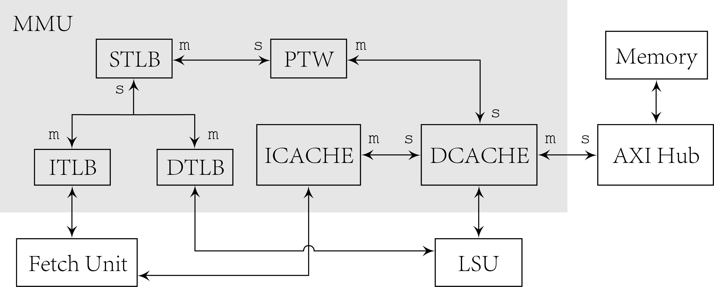

# Memory Management Unit

Memory management unit consists of cache and TLB to handle
requests from frontend and LSU. It has slave interface for
connections with pipeline, and master interface with AXI memory
interface. The basic architecture is as following figure.

ITLB and DTLB connects their slave interfaces with fetch unit
and LSU respectively. Their master interfaces are connected
with STLB of which master interface is connected with page
table walker. The calculation of physical page address need to
access memory, so that it uses master interface to access data
cache. Connecting to data cache instead of memory avoids
coherence issue. Instruction cache also connects slave
interface with fetch unit and access data cache on miss to
avoid coherence issue. Except extra access of instruction cache
and page table walker, data cache handles requests from LSU
naturally and uses master interface to access memory through
AXI hub when cache miss happens.

TLBs share same HDL module and the width of interface is
configurable so that STLB can take handle two requests from
ITLB and DTLB simultaneously. Interface of TLB module is
blocking. When TLB miss happens, it stucks and ignore requests
afterwards, until miss is handled and origin request is
responsed. Cache entities also shares same module which is
configurable. The interface of cache module can be non-blocking
which returns a miss handle immediately and can continue handle
requests afterwards. After a miss in MSHR is finally handled,
cache returns the result through slave interface. If MSHR is
full and unable to receive missed requests, it will stuck like
missing situation of TLB. Data cache can receive write request.
For write requests, cache should check whether the address hits
and read the whole cache block. If it hits, cache will take an
extra cycle to write into cache and response.

TLB and cache can be directly-mapped, set-associative and
fully-associative by setting of parameter `way`. Within a set
the replacement algorithm is pseudo-LRU, maintaining binary
decision trees for each set.

## Cache Module

Cache module is non-blocking, configurable and with simplified
transaction interface. To support non-blocking access, the
interface adds an `miss` port to indicate a miss and miss ID.
Because there are situations that succeeding requests access
same block with previous missed request i.e., miss under miss,
miss ID of these requests should be same.

When a memory access request is sent to cache module, firstly
cache module access block RAM to get related set using index of
corresponding address. The set includes `valid` bit, `dirty`
bit, `tag` and `data`. After comparing tag, if there is a hit,
cache module output the corresponding data. Otherwise, it
searches in MSHR and matches addresses. If there is a match in
MSHR, cache module returns miss ID in the MSHR entry, otherwise
cache module allocate a new entry in MSHR and use request ID as
new miss ID. If MSHR is full in this situation, cache will not
response this request until it is able to handle this miss.

## TLB Module

TLB module has blocking transactions. When a miss happens, TLB
will issue a request to higher level TLB or PTW through master
interface, and not response to slave interface until miss is
resolved. Each entry has `vld`, `tag`, `dat` and `prm` fields.
Each bit in `prm` indicates permission for read/write/execute
of corresponding physical page address.

Replacement algorithm in cache and TLB module is psuedo-LRU
with implementation of binary decision tree. When cache access
or cache fill happens, modules will update the tree to provide
approximately earliest unused entry.
