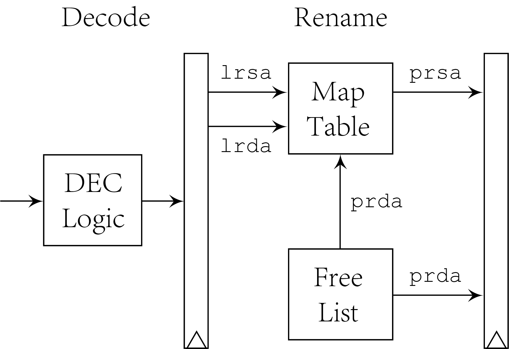

# Renaming Stage

Renaming stage takes decoder bundles from decoding stage. It
allocates new physical destination register and maps logical
source registers for each decoded operation. Hence the basic
entities in renaming stage are map table and free list.

## Renaming Module

File `rename.sv` includes renaming module, maintaining map
table, free list and their snapshots. The snapshots are set to
support recovery after execution, so that redirected operations
can use branch ID `brid` to index in snapshots and recover map
table and free list in one cycle. Because steps of changes in
map table should be recorded in map table, map table can only
be implemented by registers, while the snapshots of map table
are implemented by RAM. The implementation of free list is a
bitmap. Each bit of free list indicates the free situation of
corresponding physical register. Deallocation can affect bits
in snapshots so that snapshots of free list also use registers.

The allocation of renaming resources happens after decoding
stage, while deallocation is at commit stage. If an operation
is committed, its previous mapped physical register of logical
destination register is no longer used and can be deallocated
in free list.
