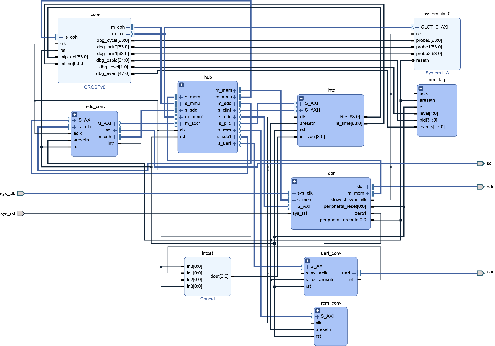

# SoC Components

SoC directory builds example system-on-chip on simulation or
FPGA environment. Except top module of CROSP core, there are
also hubs and memory-mapped peripherals. The following figure
is an example diagram on Genesys-2 FPGA.

## Core Top Module

CROSP core is an AXI master device. In top module, all parts of
pipeline and MMU is instantiated. The interface is mostly
connected with MMU, and also includes interrupt info from CLINT
and PLIC. Users can set some debug ports with prefix `dbg_` in
current design to connect with performance monitor or debug
module e.g., ILA on FPGA. In this module, all signals can be
accessed through Verilog hierarchy, so that it is convenient to
do some monitor stuff without changing internal source code and
interface.

## AXI Hub

AXI hub connects all master and slave AXI devices. To make the
interconnection more configurable and support extension like
ACE protocol in future, AXI hub does not use IP on FPGA and
uses standalone Verilog module instead. In this module, users
should define interfaces, their base addresses and their
aliases to be involved in master-slave arbitration. Conncetion
will be established by connecting a master with a slave
according to read or write transaction raised by one master.
The connection remains until the transaction being finished.

Because memory is shared between core, PK handler and DMA
requests from peripherals, basic coherence protocol should be
implemented even if there is only single-core environment now.
Custom coherence interface includes master and slave groups.
If a device requires local ownship of a cache block, it firstly
send its request through master group of coherence interface.
Then coherence hub will broadcast this request to other devices
and the device which currently owns the block will response
with slave group after evicting the block through AXI
interface.

Currently coherence interface is splitted with AXI
interface and no data forwarding is supported. This may result
in heavy traffic if more cores are included. More comprehensive
interface like ACE may be implemented in future.

## Memory-Mapped Peripherals

In typical design of RISC-V core and Linux kernel, devices can
be implemented by memory-mapped IO (MMIO). In current
implementation of CROSP in simulation environment and on FPGA,
UART controller and SD card controller are included to support
basic OS verification.

UART and SD controller uses the same code with repository
`vivado-risc-v`, and wrap them with SystemVerilog module. The
wrappers rename ports and parameters with CROSP standard.
Except uniforming, in DMA devices like SDC, wrapper also serves
as coherence handler.
